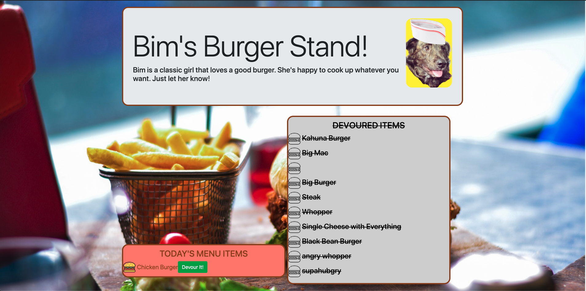

# Bim's Burger Stand

Bim's Burger Stand is a fun web application where users can order a burger via the input box and devour that burger by clicking the Devour It! button. The burger is added to the MySQL database, appears in Today's Menu Items and moves to the DEVOURED ITEMS menu after the user clicks the devour button

## Frameworks
- Node.js
- Express
- MySQL
- Handlebars Templating Engine
- NPM Method-Override to allow DOM manipulation in places where this is normally not allowed
- MVC (Model/View/Controller) method

## To run Bim's Burgers on your local machine open the CLI of your choice
### Clone to your local computer :octocat:
```sh
$ git clone https://github.com/androosk/bims-burgers.git
```
### Install NPM Dependencies
```sh
$ cd bims-burgers
```
```sh
$ npm install
```
### Install Schema and Seed Data
```sh
$ cd db
$ mysql -u USERNAME -p
> [enter password]
> source schema.sql
> source seeds.sql
> exit
$ cd ..
``` 
### Run Project
```sh
$ npm run server
```
### In your web browser go to address localhost:3000

## Deployment Link :link:
This app is deployed to Heriku at
https://bimsburgers.herokuapp.com/
